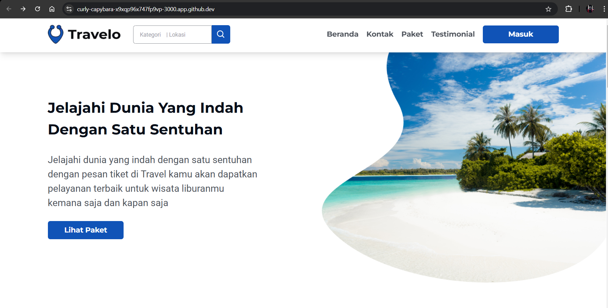

# Travello

Travello is a travel web display / frontend / UI using TypeScript, React, NextJS, TailwindCSS technology

## Pages

- Login Page


- Home Page


## Instalasi

Berikut adalah langkah-langkah untuk menginstal aplikasi Travello:

1. Clone repositori ini:

    ```bash
    git clone https://github.com/username/travello.git
    ```

2. Masuk ke direktori proyek:

    ```bash
    cd travello
    ```

3. Instal dependensi:

    ```bash
    npm install
    ```

4. Jalankan aplikasi:

    ```bash
    npm start
    ```
    
## Lisensi

Aplikasi ini dilisensikan di bawah [MIT License](LICENSE).
